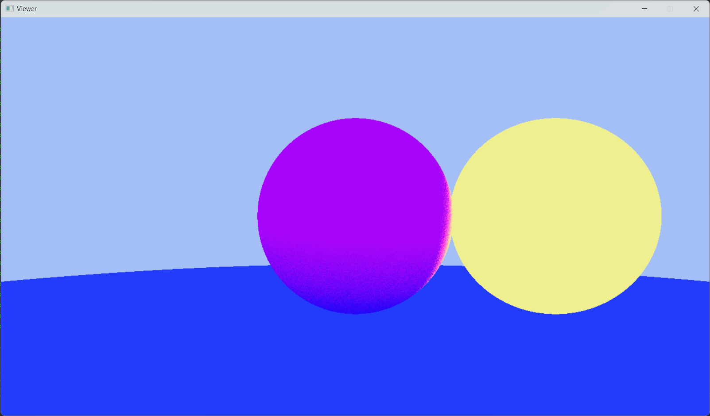

# renderer
A tiny soft-renderer

# preview
| scene                    | preview                                                                       |
| ------------------------ | ----------------------------------------------------------------------------- |
| simple ray tracing (wip) |                                 |

## Getting Started

### Windows

Visual Studio 2022 is recommended

<ins>**1. Downloading the repository:**</ins>

```
git clone https://github.com/Sigurd015/renderer
```

<ins>**2. Run the [setup_win.bat](scripts/setup_win.bat)**</ins>

<ins>**3. Open .sln file with Visual Studio**</ins>